# New API
### Linux.do公益版
> [!NOTE]
> 本项目为开源项目，在[One API](https://github.com/songquanpeng/one-api),[New API](https://github.com/linux-do/new-api)的基础上进行二次开发

> [!IMPORTANT]
> 使用者必须在遵循 OpenAI 的[使用条款](https://openai.com/policies/terms-of-use)以及**法律法规**的情况下使用，不得用于非法用途。
> 本项目仅供个人学习使用，不保证稳定性，且不提供任何技术支持。
> 根据[《生成式人工智能服务管理暂行办法》](http://www.cac.gov.cn/2023-07/13/c_1690898327029107.htm)的要求，请勿对中国地区公众提供一切未经备案的生成式人工智能服务。


## 主要变更
此分叉版本的主要变更如下：

1. 额度签到(前端可配置)
2. 消息穿透
3. qa记录(仅记录文字)
4. 额度有效期
5. 道德审查(前端可配置)
6. 额度上限
7. 添加用户协议(前端可配置)

## 更新记录
20240922:

1. 签到功能重构，前端可配置
2. 添加用户额度上限
3. 优化用户信息展示
4. 加入用户协议配置

20240810:
    
1. 修复模型计费bug
2. 修复额度巡检回收bug
3. 签到功能允许vip分组用户

## 部署
### 部署要求
- 本地数据库（默认）：SQLite（Docker 部署默认使用 SQLite，必须挂载 `/data` 目录到宿主机）
- 远程数据库：MySQL 版本 >= 5.7.8，PgSQL 版本 >= 9.6

### 使用指南
1. 上传源码到服务器目录(这里举例为/home/kites_api/new-api,请部署时更换为自己的路径)
2. 修改docker-compose.yml文件内容如下
```yml
version: '3.4'

services:
  new-api:
    build: /home/kites_api/new-api
    container_name: kites-api
    restart: always
    command: --log-dir /app/logs
    ports:
      - "3999:3000"
    volumes:
      - ./data/new-api:/data
      - ./logs:/app/logs
    environment:
      - SQL_DSN=数据库用户:数据库密码@tcp(ip:端口)/linux-api
      - REDIS_CONN_STRING=redis://:redis密码@ip:端口
      - SESSION_SECRET=linux_do  # 修改为随机字符串
      - TZ=Asia/Shanghai
      #      - NODE_TYPE=slave  # 多机部署时从节点取消注释该行
      - SYNC_FREQUENCY=60  # 需要定期从数据库加载数据时取消注释该行
#      - FRONTEND_BASE_URL=https://openai.justsong.cn  # 多机部署时从节点取消注释该行
```
3. 执行以下命令即可

```sheel
cd /home/kites_api/new-api/
docker-compose build new-api
docker-compose up -d
```
## 功能截图

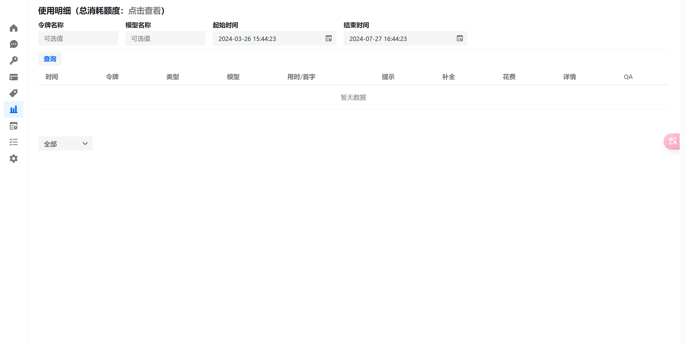
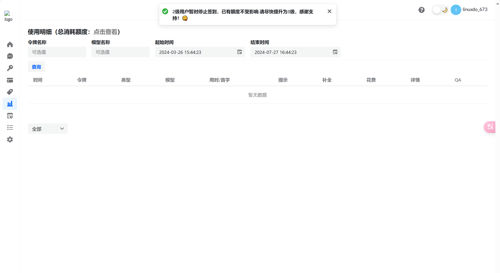
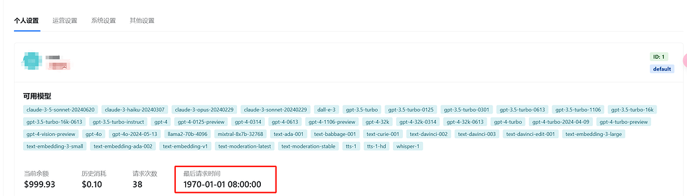
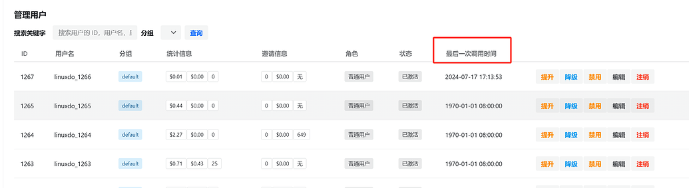
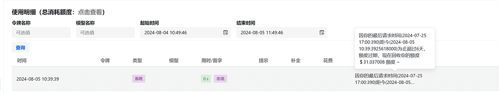
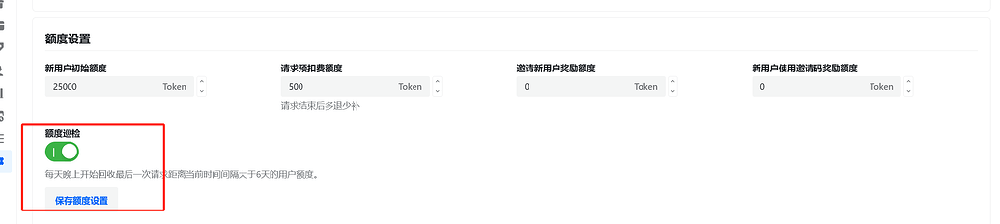
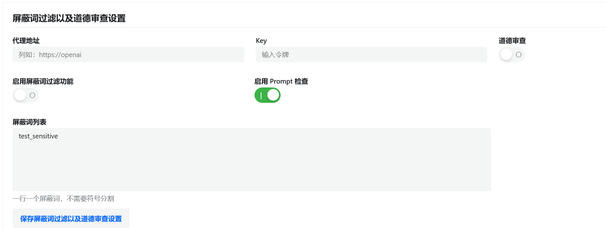
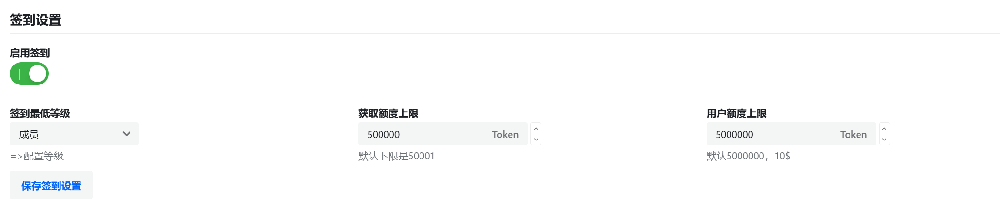
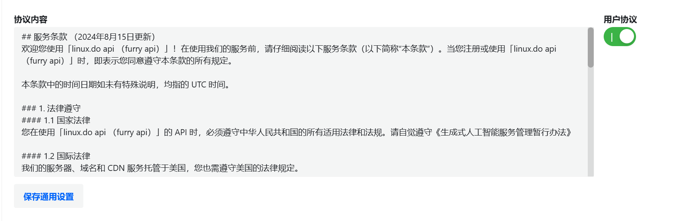
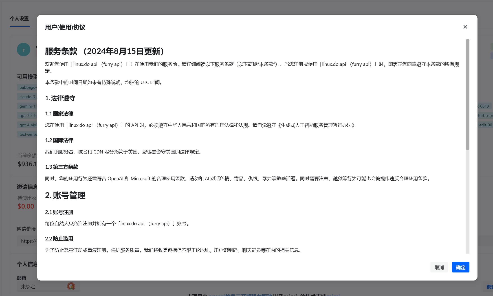
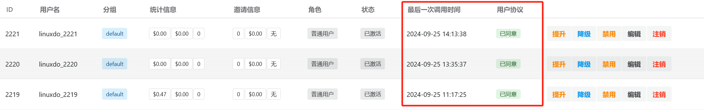
## 技术支持

- [Linux.do](https://github.com/linux-do)

- [BennyThink](https://github.com/BennyThink)

## 快速反馈
- [全球工单中心](https://linux.do/u/furry/summary)
## 相关项目
- [One API](https://github.com/songquanpeng/one-api)：原版项目
- [Midjourney-Proxy](https://github.com/novicezk/midjourney-proxy)：Midjourney接口支持
- [chatnio](https://github.com/Deeptrain-Community/chatnio)：下一代 AI 一站式 B/C 端解决方案
- [neko-api-key-tool](https://github.com/Calcium-Ion/neko-api-key-tool)：用key查询使用额度
